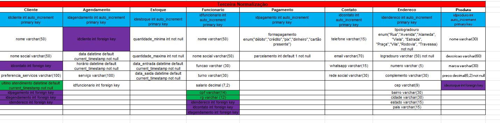

# Estudo de Caso: Salão de  Cabelereiro "Cabelos Incríveis"

O salão e um estabeleciomento localizado em uma area movimentada da cidade. O salao oferece uma variedade de servicos, incluindo cortes de cabelo, coloração, tratamentos capilares, manicure e pedicure. Eles tem uma equipe de cabeleleiros talentosos e uma base de cliente fieis.

Desafio: O salão esta enferentando dificuldades para gerenciar eficientemente seus clientes, agendamentos, estoque de produtos e informacoes dos funcionarios. Eles precisam de um sistema de banco de dados para ajudar a organizar e automatizar esses processos.

Requisitos do Sistema: gerenciamento de clientes.
Cadastro de novos clientes com informacoes como nome, endereço, telefone, e-mail, preferencias de servicos, historico de servicos realizados, etc.

Registro de servicos realizados por cada cliente, incluindo datas, tipos de servico, cabeleleiro responsavel, etc. Possibilidade de atualizacao e exclusao de informacoes de clientes.

agendamento de serviços: Capacidade de agendar serviços para clientes, incluindo data, horario, tipo de serviço, cabeleleiro responsavel, etc. Visualizacao rapida de disponibilidade de horarios e cabeleleiros para agendamento.

Gerenciamento de estoque:
controle de estoque de produtos utilizados no salão, como tinturas, shampoos, condicionadores, etc.

Informações de funcionarios:
Cadastro de informações dos funcionários, incluindo nome, função, horario de trabalho, salario, etc.

Atribuicao de serviços realizados por cada funcionario e acompanhemnto de seu desempenho.

### Modelo Conceitual do estudo de caso

### Modelo Lógico

### Primeira Normalização

### Segunda Normalização

### Terceira Normalização

